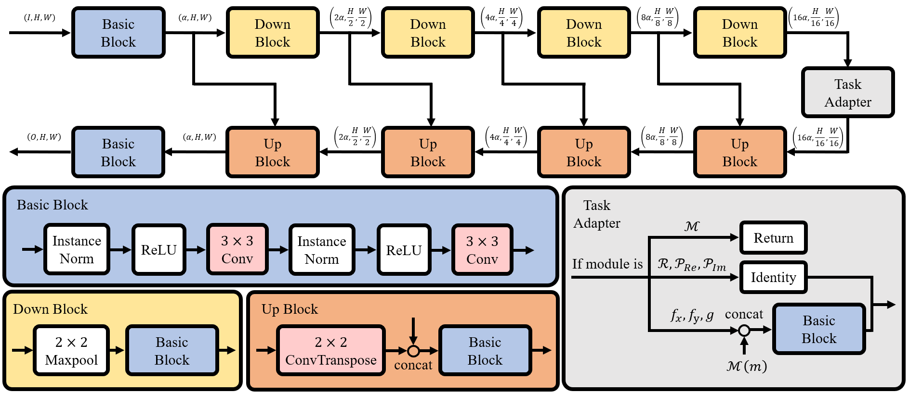
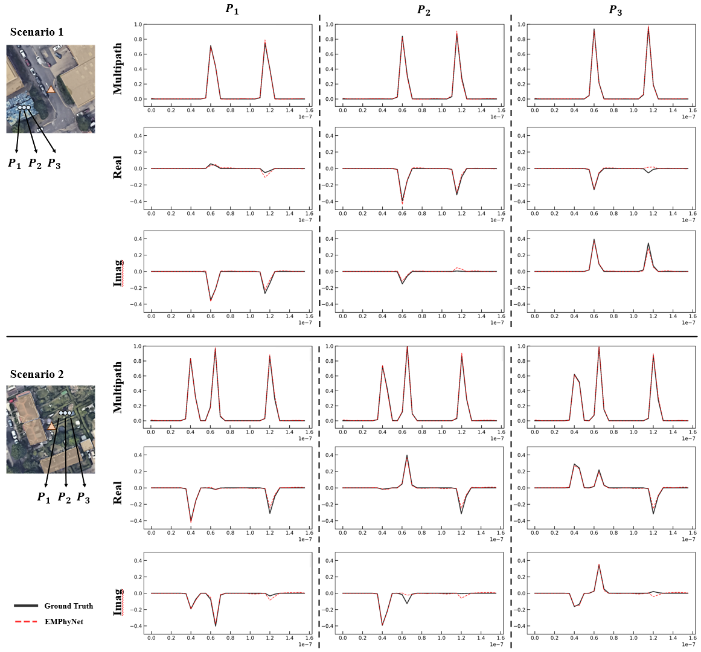

# Temporal–Spatial Wavefront Sequence and EMPhyNet

## Introduction
In wireless communications, interactions of electromagnetic (EM) waves with environmental scatterers lead to multipath propagation, which underpins the spatial multiplexing capabilities of advanced technologies such as large-scale Multiple-Input Multiple-Output (MIMO), beamforming, and Reconfigurable Intelligent Surfaces (RIS). 
<br>
<br>
To characterize the intricate spatiotemporal dynamics, we introduce the Temporal–Spatial Wavefront Sequence (TSWS) to represent the spatial Channel Impulse Response (CIR) and construct a large-scale TSWS simulation dataset spanning 1,075 real-world environments via Ray Tracing (RT), providing a unified foundation for comprehensive channel modeling and transmission research. 
<br>
<br>
<div>

</div>
<br>
<br>
Moreover, leveraging first-principles physics, we embed Finite Difference Time Domain (FDTD) iterative framework, a full-wave method for solving Maxwell’s equations, into our proposed EM Physics-Informed Network (EMPhyNet), directly simulating TSWS. The EMPhyNet effectively learns spatial propagation patterns such as direct paths, reflections, amplitude decay, and phase variations, achieving NRMSE and improved masked NRMSE of approximately 0.073 and 0.11. Evaluation of variant models shows that those without explicit Maxwell propagation priors fail to capture meaningful signal features.
<br>
<br>
<div>

</div>
<br>
<br>
<div>

</div>
<br>
<br>
Together, TSWS and EMPhyNet integrate physics principles with deep learning to accurately reconstruct both amplitude and phase, enabling high-fidelity spatial wireless channel characterization for next-generation communication systems.

## Requirements

Linux + python>=3.8 + pytorch(GPU)

- matplotlib==3.7.5
- torch==2.4.1
- torchvision==0.19.1
- numpy==1.24.1
- h5py==3.11.0
- tqdm==4.67.1
- Pillow==10.2.0
- scikit-learn==1.3.2
- opencv-python==4.11.0.86

While the code is theoretically compatible with Windows, we highly recommend running it on a Linux system to ensure consistent results.

## Datasets and Pretrained models
- There are only two examples here, please download other [data](XXXXXXXXXXXXXXXXXX) as needed all data.

Scenarios information obtained from [OpenStreetMap](https://www.openstreetmap.org/). The TSWS are constructed by [Ray Tracing of Matlab](https://www.mathworks.com/help/comm/ref/rfprop.raytracing.html). 

Please unzip `data.zip` and put the folders `input`, `output_rt_32`, 'output_real_32',and `output_imag_32` in `./data`.

Please unzip `matlab.zip` and put the folders `data`, `map_data`, and 'map_height' in `./matlab`.

Please unzip `results.zip` and put all 22 folders in `./results`.

## Run

Please refer to  `./run.sh` and `./main.py` for training and testing.

Please refer to  `./Visualization_and_MSE.py` for visualization and MSE calculation.

## Results

AE refers to the Absolute Error.

### Wavefront trajectory
<br>
<div>

</div>
<br>

### Scenario 1 (Real Part)
<br>
<div>

</div>
<br>

### Scenario 2 (Real Part)
<br>
<div>

</div>
<br>

### CIRs
<br>
<div>

</div>
<br>

## Citation
Please cite our paper when you use this code.
```
XXX
```

## Contact
Please contact wangshuchen@ucas.ac.cn if you have any question about this work.
